# MEW INDUSTRIES API

## 1) Requirements

- **Java:** OpenJDK **17.0.16** (`java -version`)  
- **Gradle:** Wrapper included (`./gradlew …`)  
- **Database:** Use the group DB repo for schema/setup & connection details:  
  [WSU-kduncan/cs4900-m-e-w-industries › DatabaseDesign/README.md](https://github.com/WSU-kduncan/cs4900-m-e-w-industries/blob/main/DatabaseDesign/README.md)  
- **Docker:** Running the database container  
- **Bruno:** For API testing

---

## 2) Project Layout

```text
cs4900-api-m-e-w-industries
├─ demo/                       # Spring Boot app (Gradle project)
│  ├─ bruno/                   # Bruno collection & environments
│  │  ├─ collection.bru
│  │  ├─ environments/
│  │  ├─ bruno.json
│  │  ├─ game/
│  │  ├─ matcheduser/
│  │  └─ user/
│  ├─ build.gradle
│  ├─ gradlew, gradlew.bat, gradle/
│  └─ src/
│     └─ main/
│        ├─ java/com/mew/demo/...
│        │  GamerMatchApplication.java
│        └─ resources/
├─ homework/
├─ MEWdb/
├─ SQL/
└─ README.md

```

## 3) Database

Follow the **group DB repo** for schema and setup (Docker Compose, seed data, ports, credentials, etc.):  
[DatabaseDesign/README.md](https://github.com/WSU-kduncan/cs4900-m-e-w-industries/blob/main/DatabaseDesign/README.md)

1. **Start the database container** from the `MEWdb/` directory (where `docker-compose.yml` lives) run:
```
docker-compose up
```

2. **Verify the connection** (e.g., in DBeaver) before starting the API.

## 4) Start the Service

From the `demo/` folder (where `build.gradle` lives):

```bash
./gradlew bootRun
```
## 5) Testing with Bruno

**Collection path:** `cs4900-api-m-e-w-industries/demo/bruno`

**Steps**
1. Open Bruno and **Open Collection** → select the `demo/bruno` folder.  
2. Choose **Environment**: `local` (ensure `BASE_URL` matches your running service).  
3. Run requests in folders: **user**, **game**, **matcheduser**.  
4. Expect **HTTP 200** for basic GETs and **201** for valid POST/PUT.

## 6) API Endpoints

**{{BASE_URL}}** `http://localhost:8080/GamerMatch`


### GET
- `GET {{BASE_URL}}/games` — List all games.

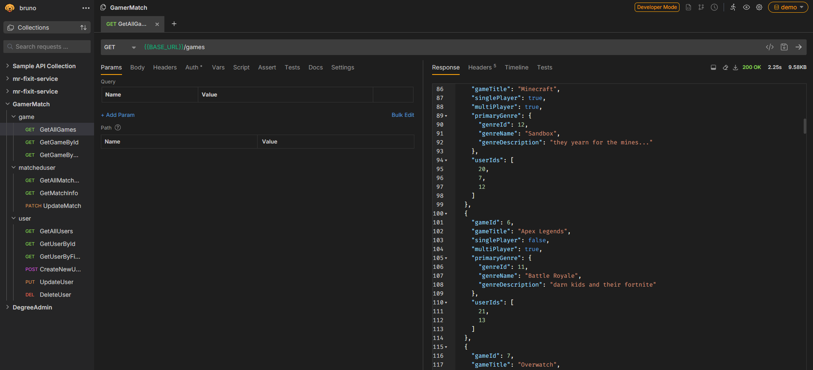
  
- `GET {{BASE_URL}}/games/id/:id` — Get a single game by numeric `:id`.

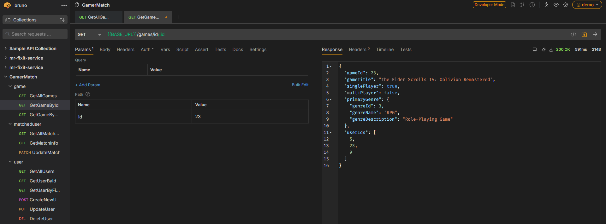
 
- `GET {{BASE_URL}}/games/title/:title` — Find games by `:title`.

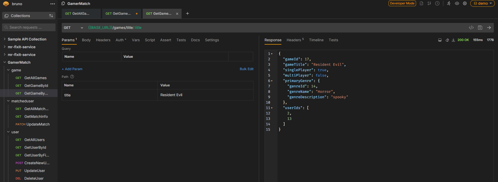

- `GET {{BASE_URL}}/matches/user/id/:id` — Get all matches for user `:id`.

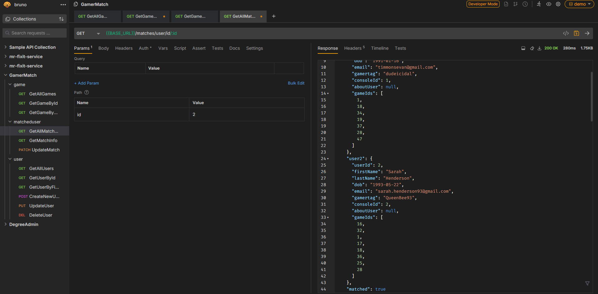

- `GET {{BASE_URL}}/matches/:userId/:matchId` — Get the match record for `:userId` vs `:matchId`.

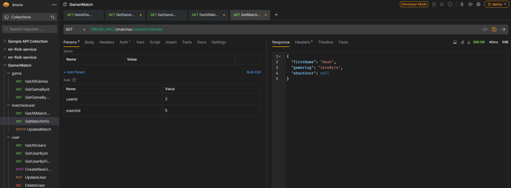

- `GET {{BASE_URL}}/users` — List all users.

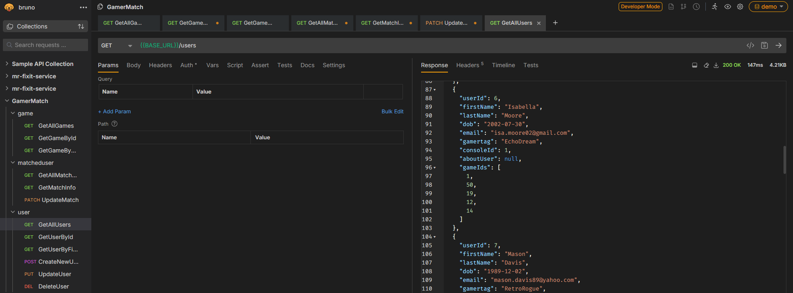

- `GET {{BASE_URL}}/users/id/:id` — Get a single user by numeric `:id`.

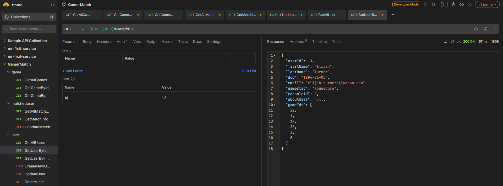

- `GET {{BASE_URL}}/users/name/:firstName` — Search users by `:firstName`.

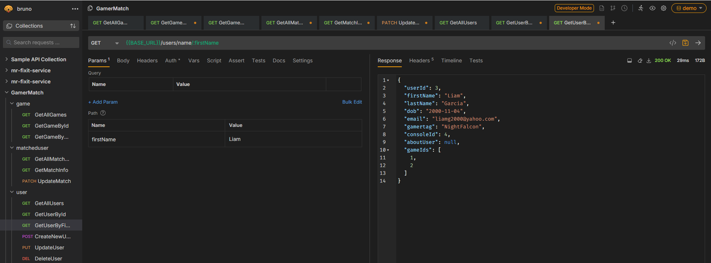

### PATCH
- `PATCH {{BASE_URL}}/matches/:userId/:matchId` — Update an existing match record

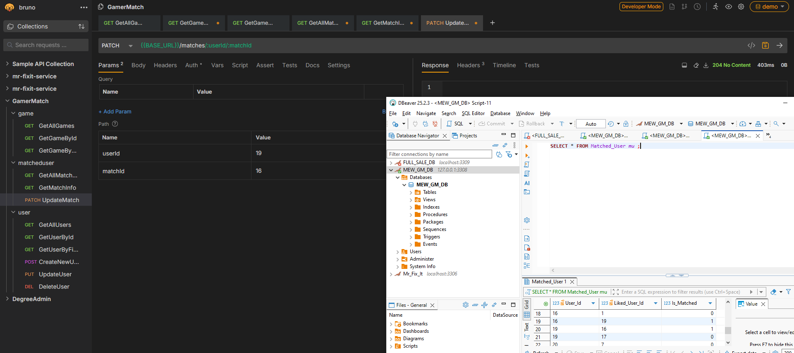

### POST

- `POST {{BASE_URL}}/users` — Create a new user. (**Body:** JSON user object.)

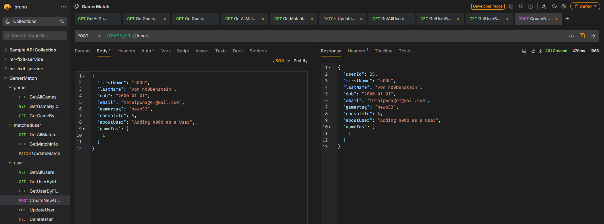

- `POST {{BASE_URL}}/games` - Create/add a game (**Body:** JSON user object.)

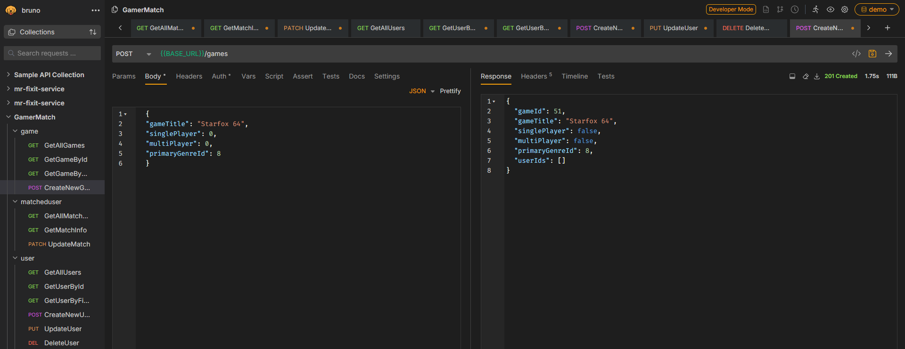

### PUT
- `PUT {{BASE_URL}}/users/id/:id` — Replace or update a user by `:id`.  (**Body:** JSON user object.)

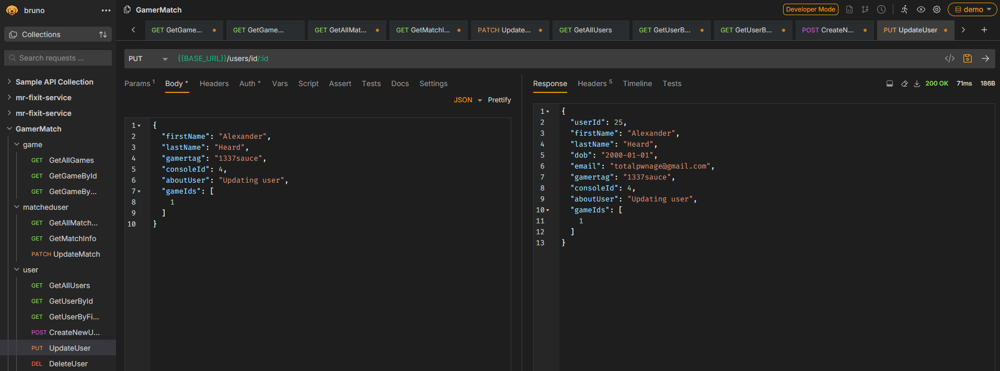

### DELETE
- `DELETE {{BASE_URL}}/users/id/:id` — Delete a user by `:id`.

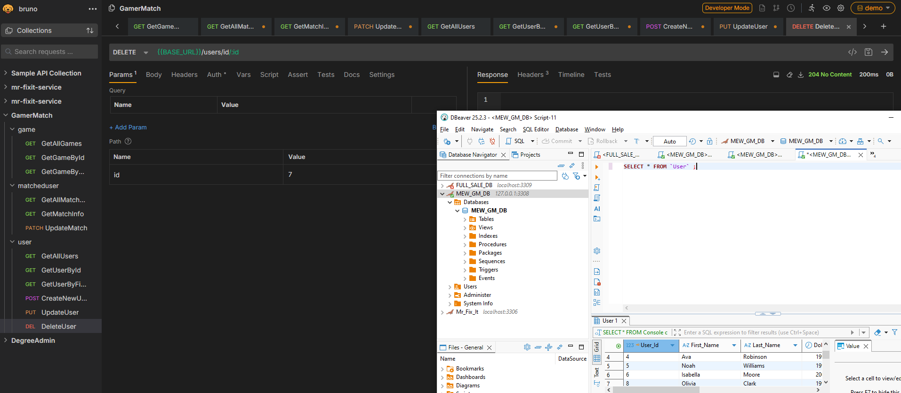

**Notes**
- Replace `:id`, `:userId`, `:matchId`, and `:firstName` with actual values.  
- Request/response shapes follow your DTOs/entities—use the Bruno collection in `demo/bruno` for exact fields and sample payloads.
